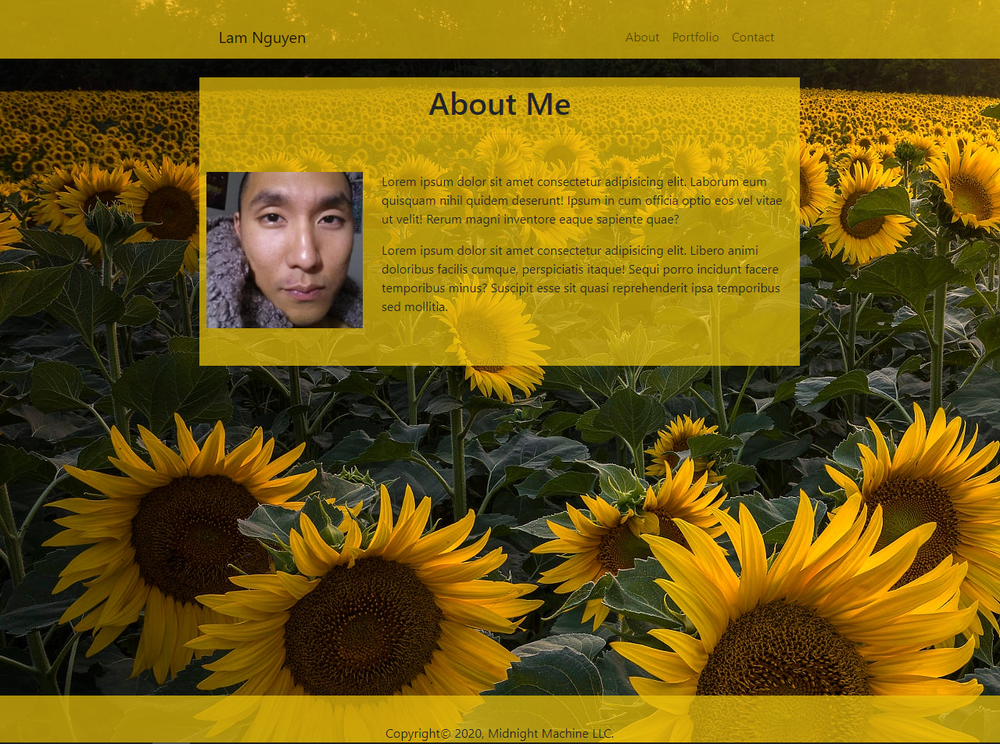

# Portfolio-React

Create a Personal Portfolio using React

### Prerequisites and Deployment

* Installation of Web Browser to view webpage
* Visual Studio Code to analze the code for the website
* Node.js
* React JS
* Installation of Node Package Modules

## Built With

* Visual Studio Code
* Node.js
* React JS

## Author

**Lam Nguyen**

## License

The Unlicense

## Deployed Application

View deployed application [here](https://lamcnguyen89.github.io/Portfolio-React/)

